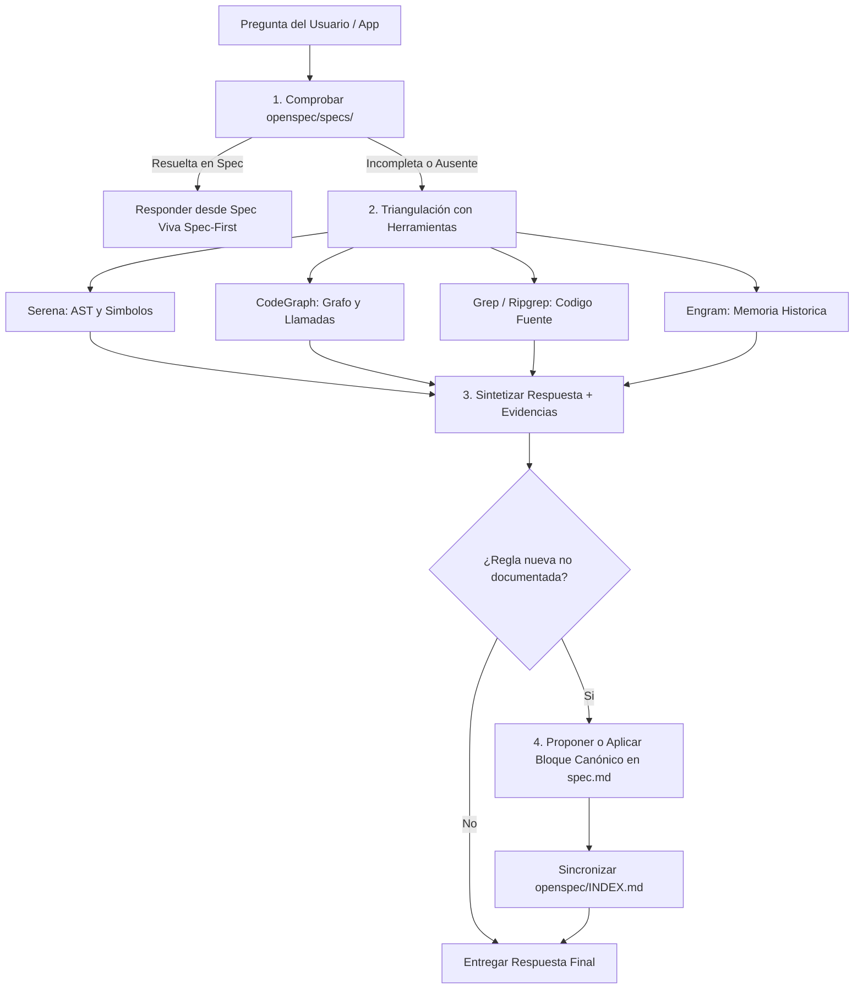

## Activation Contract

Carga esta skill cuando el usuario o el aplicativo formulen preguntas técnicas o funcionales sobre el sistema, su arquitectura, flujos o reglas de negocio (ej. "¿cuáles son los campos para dar de alta un usuario?", "¿cómo se procesan los reembolsos?", "¿qué dependencias tiene el módulo X?").

Esta skill gobierna la investigación basada en evidencias y protege la integridad de la Spec Viva (`openspec/specs/`).

---

## Hard Rules

1. **Estrategia Spec-First Obligatoria:**
   - La primera acción de lectura DEBE ser siempre inspeccionar `openspec/INDEX.md` y las especificaciones vivas del dominio en `openspec/specs/<dominio>/spec.md`.
   - Si la respuesta se encuentra documentada y actualizada en la Spec Viva, responde directamente citando el requerimiento formal (`### Requirement: ...`), sin consumir herramientas de código innecesariamente.

2. **Uso de Herramientas Reales (Sin Búsquedas Naive):**
   - Si la spec no cubre la consulta o requiere mayor nivel de detalle técnico, utiliza exclusivamente las herramientas semánticas configuradas en el workspace (`.mcp.json`):
     - **Serena MCP:** `find_symbol`, `get_ast`, `search_definitions` para inspeccionar structs, interfaces, firmas de funciones y métodos.
     - **CodeGraph MCP:** para trazar grafos de dependencias, llamadas entre paquetes y consumidores de interfaces.
     - **Grep / Ripgrep / File View:** para anclajes directos de cadenas, constantes y comentarios de código.
     - **Engram MCP:** (`mem_search`, `mem_context`) para recuperar contexto histórico de decisiones o cambios previos.

3. **Contrato de Respuesta en Dos Niveles:**
   Toda respuesta debe estructurarse estrictamente en dos partes:
   - **Nivel 1 — Respuesta Directa:** Explicación conceptual, concisa y rigurosa en castellano técnico peninsular.
   - **Nivel 2 — Evidencias Verificadas:** Lista de anclajes directos con formato `ruta/fichero.ext:línea` o símbolo de código, explicando brevemente qué prueba cada evidencia.

4. **Curación Estricta de la Spec Viva (No Contaminar la Fuente de Verdad):**
   - Una consulta de lectura NUNCA debe modificar archivos en disco de forma silenciosa ni automática.
   - Si durante la investigación descubres una regla técnica o funcional relevante que **no existe** en `openspec/specs/<dominio>/spec.md`:
     1. Redacta la propuesta de nuevo requerimiento en formato canónico OpenSpec:
        ```markdown
        ### Requirement: <Título Descriptivo de la Regla>
        <Explicación de la regla de negocio y comportamiento observado.>

        #### Scenario: <Condición de Validación>
        - **DADO** <contexto o estado del componente>
        - **CUANDO** <acción o evento que dispara la regla>
        - **ENTONCES** <resultado verificable en código>
        ```
     2. Presenta la propuesta al usuario o al aplicativo para su confirmación antes de escribir en disco, o aplícala solo si el invocador solicitó explícitamente `--enrich` o modo actualización.
     3. Tras cualquier edición confirmada en una spec viva, ejecuta `axiom archive sync` para regenerar `openspec/INDEX.md`.

---

## Protocolo de Ejecución



---

## Formato de Salida Requerido

```markdown
### Respuesta
[Explicación precisa y directa a la pregunta formulada]

### Evidencias de Código
- `internal/identity/users.go:42` — Struct `UserRegisterRequest` con los campos validados.
- `internal/identity/handler.go:88` — Método `Register` que aplica la regla de unicidad de email.

### Estado de la Especificación Viva
- [x] Regla documentada previamente en `openspec/specs/identity/spec.md` (REQ-04).
<!-- O BIEN -->
- [ ] Regla descubierta no documentada. Propuesta de requerimiento generada para `openspec/specs/identity/spec.md`.
```
